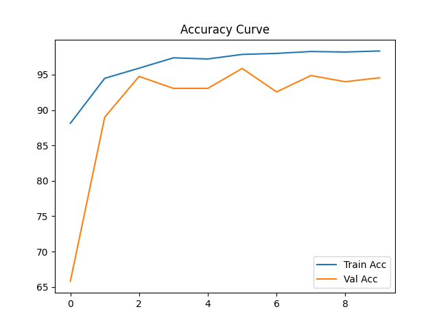
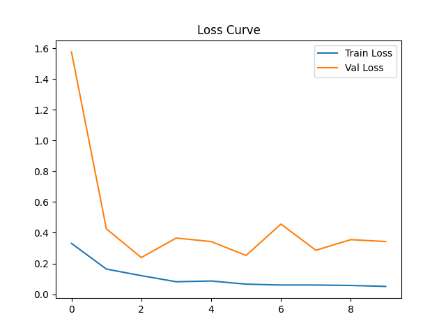
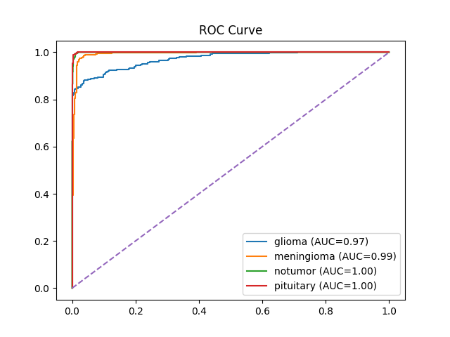
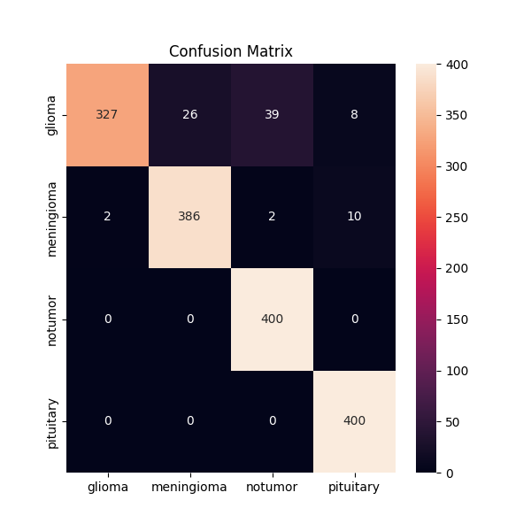

Brain Tumor Detection Using MRI Scans


Deep learning-based multi-class brain tumor classification from MRI scans using ResNet-18 transfer learning — 95.88% validation accuracy across 4 tumor classes.


Overview

This project implements a convolutional neural network (CNN) pipeline to classify brain MRI scans into four categories: Glioma, Meningioma, Pituitary Tumor, and No Tumor. It uses transfer learning on a pretrained ResNet-18 backbone, trained on approximately 7,000 labeled MRI images from the Kaggle Brain MRI Dataset.

A Tkinter-based GUI (predict.py) allows real-time inference — upload any MRI image and get an instant prediction with confidence score.


Results

| Metric | Value |
|--------|-------|
| Training Accuracy | 98.7% |
| Best Validation Accuracy | 95.88% |
| Training Loss (final) | 0.037 |
| Epochs | 10 |

ROC-AUC Scores
| Class | AUC |
|-------|-----|
| Pituitary | 1.00 |
| No Tumor | 1.00 |
| Meningioma | 0.99 |
| Glioma | 0.97 |

Confusion Matrix Highlights
- No Tumor: 400/400 — perfect classification
- Pituitary: 400/400 — perfect classification
- Meningioma: 386/400 — 96.5% accuracy
- Glioma: 327/400 — 81.8% accuracy (minor confusion with Meningioma)

Training Curves

| Accuracy | Loss |
|----------|------|
|  |  |

### ROC Curve & Confusion Matrix

| ROC Curve | Confusion Matrix |
|-----------|-----------------|
|  |  |

---

Dataset

**Source:** [Kaggle Brain MRI Dataset](https://www.kaggle.com/datasets/masoudnickparvar/brain-tumor-mri-dataset)

| Class | Train (~80%) | Test (~20%) |
|-------|-------------|------------|
| Glioma | ~1,050 | ~271 |
| Meningioma | ~1,080 | ~259 |
| Pituitary | ~1,170 | ~287 |
| No Tumor | ~1,275 | ~320 |
| **Total** | **~5,575** | **~1,137** |

> Dataset not included in this repo. Download from Kaggle and place in `data/raw/Training/` and `data/raw/Testing/`.


Model Architecture

Base: ResNet-18 pretrained on ImageNet  
Modified FC head:

ResNet-18 backbone (frozen feature extractor)
    └── Dropout(0.5)
    └── Linear(512 → 512)
    └── ReLU()
    └── Dropout(0.3)
    └── Linear(512 → 4)


Why ResNet-18?
- Residual connections prevent vanishing gradients
- Lightweight — fast training on limited hardware
- Pretrained ImageNet weights transfer well to medical imaging
- Easily customizable final layers


Training Configuration

| Parameter | Value |
|-----------|-------|
| Loss Function | CrossEntropyLoss |
| Optimizer | Adam (lr=0.0003) |
| Epochs | 10 |
| Batch Size | 32 |
| Input Size | 224 × 224 |
| Regularization | Dropout (p=0.5, p=0.3) |

**Data Augmentation (training only):**
- RandomHorizontalFlip
- RandomRotation(15°)
- ColorJitter (brightness=0.2, contrast=0.2)
- ImageNet normalization


Project Structure


brain-tumor-detection/
├── data/
│   └── raw/
│       ├── Training/          ← Download from Kaggle
│       │   ├── glioma/
│       │   ├── meningioma/
│       │   ├── notumor/
│       │   └── pituitary/
│       └── Testing/
├── notebooks/
│   └── brain_tumor_training.ipynb
├── results/
│   ├── accuracy.png
│   ├── loss.png
│   ├── confusion_matrix.png
│   └── roc_curve.png
├── train.py                   ← Full training pipeline
├── predict.py                 ← GUI inference app
├── requirements.txt
└── README.md


Getting Started

1. Clone the repository
```bash
git clone https://github.com/ritikyadav9818/Brain-Tumor-Detection.git
cd brain-tumor-detection
```

3. Install dependencies
```bash
pip install -r requirements.txt
```

5. Download the dataset
Download from [Kaggle](https://www.kaggle.com/datasets/masoudnickparvar/brain-tumor-mri-dataset) and place images in:

```text
data/raw/Training/<class_name>/
data/raw/Testing/<class_name>/
```

4. Train the model
```bash
python train.py
```
Trained weights saved to 
``` text 
models/brain_tumor_multiclass.pth
```


5. Run inference (GUI)
```bash
python predict.py
```
A file dialog opens — select any MRI image — model outputs predicted class and confidence score.


Requirements


torch
torchvision
matplotlib
numpy
scikit-learn
seaborn
Pillow


Or install all at once:
bash
pip install torch torchvision matplotlib numpy scikit-learn seaborn Pillow


Sample Prediction


Selected: mri_scan_001.jpg
Prediction : glioma
Confidence : 94.73%


Future Work

- Grad-CAM visualization to highlight tumor regions
- Deploy as Flask web application
- Extend to WHO grade classification (Grade I–IV)
- DICOM file support for hospital integration
- Mobile deployment via ONNX / TensorFlow Lite


Authors

Ritik Yadav 


License

This project is licensed under the MIT License — see [LICENSE](LICENSE) for details.


Acknowledgements

- Dataset: [Kaggle Brain MRI Dataset](https://www.kaggle.com/datasets/masoudnickparvar/brain-tumor-mri-dataset) by Masoud Nickparvar
- Architecture: [Deep Residual Learning for Image Recognition](https://arxiv.org/abs/1512.03385) — He et al., 2016
- Framework: [PyTorch](https://pytorch.org/)
